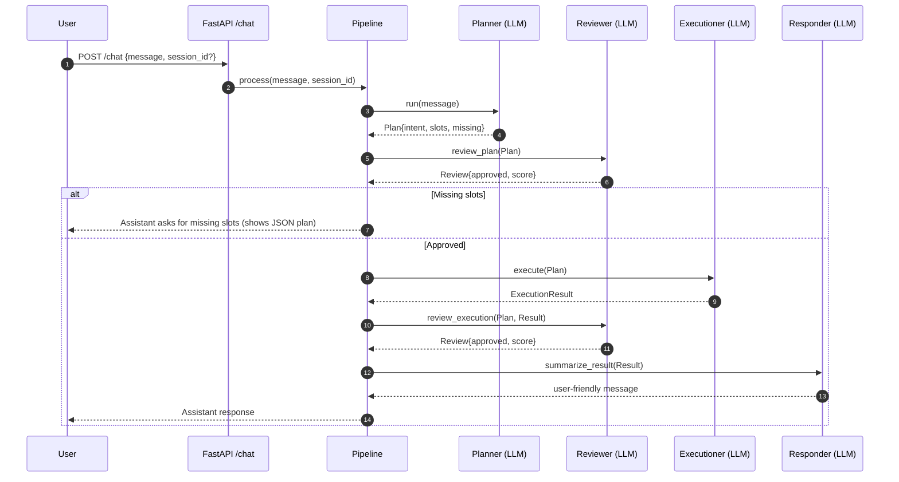

### AgenticBank Architecture and Low-Level Design

This document describes the end-to-end workflow, architecture, and low-level design of the AgenticBank PoC backend. It complements the `README.md` by detailing how each component and function works and how they interact.

---

### High-Level Overview
- Multi-agent pipeline: Planner → Reviewer → Executioner → Reviewer → Responder
- Two execution modes:
  - Rule-based (default): deterministic, regex-driven NLU and mock execution
  - LLM-based: AWS Bedrock (Claude) via `langchain-aws`, toggled by `USE_LLM`
- Session memory and logging: stateful per `session_id`, session-wise JSONL logs

#### Data flow (simplified)
```mermaid
graph TD
  A[User /chat] --> B[Planner]
  B --> C[Reviewer (plan)]
  C -- missing slots -->|awaiting_clarification| A
  C -- approved --> D[Executioner]
  D --> E[Reviewer (execution)]
  E -- approved --> F[Responder]
  F --> G[Assistant reply]
  E -- fail --> H[Fallback]
  C -- fail --> H[Fallback]
  B -- invalid --> H[Fallback]
  H --> G
```

---

### Detailed Workflow
- State machine per `session_id`: `idle` → `awaiting_clarification` → `executing` → `completed` → `idle`
- On each `/chat` request, the pipeline:
  1. Logs the `user_message`
  2. Checks for commands: cancel/reset/new request
  3. Runs Planner to detect intent and extract slots
  4. Runs Reviewer (plan) to validate completeness and safety
     - Exposes `plan_review_score` (1–10) in the API response
  5. If missing slots: prompts user, sets `awaiting_clarification` (no internal plan shown)
  6. Else executes plan with Executioner and runs Reviewer (execution)
     - Exposes `execution_review_score` (1–10) in the API response
  7. Generates a final user response via Responder (concise, empathetic)
  8. Logs assistant messages, steps, and state transitions throughout

#### Clarification loop and memory merge
- When awaiting clarification, user replies (even slot-only) are merged into the existing plan using previous intent.
- The pipeline shows the current plan in a code block and explicitly asks for missing slots.

---

### Modules and Functions

#### `app/main.py`
- `app`: FastAPI app with CORS
- `GET /health`: returns `{status: "ok"}`
- `POST /chat`: body `ChatRequest`, returns `ChatResponse` via `AgentPipeline.process`

#### `app/core/types.py`
- `IntentName`: Enum of supported intents
- `INTENT_TO_REQUIRED_SLOTS`: mapping from intent to required slot names
- `SessionState`: `idle|awaiting_clarification|executing|completed`
- `ReviewType`: `plan|execution`
- `Message`: chat message envelope
- `Plan`: planner output with `intent`, `slots`, `missing_slots`, `rationale`
- `Review`: reviewer output with `approved`, `issues`, `score` (1–10), `review_type`
- `ExecutionResult`: execution output with `success`, `data`, `error`, metadata `action_name`, `elapsed_ms`
- `ChatRequest` / `ChatResponse`: API DTOs
- `ChatResponse`: adds optional `plan_review_score`, `execution_review_score` (both 1–10)

#### `app/core/logger.py`
- `SessionLogger(session_id, base_dir=None)`
  - Writes JSONL records to `backend/logs/session_<session_id>.jsonl`
  - `write(event_type, payload)`
  - `step(name, input_data, output_data)` → agent step record
  - `user_message(text)` / `assistant_message(text)`
  - `state_transition(prev, new)`
  - `info(message, **kwargs)`

#### `app/core/nlu.py`
- `detect_intent(text) -> Optional[IntentName]`
  - Regex-based PoC intent detection (lost/stolen card, fraud, open account, check balance, transfer)
- `extract_slots(intent, text) -> (slots: Dict[str, Optional[str]], missing: List[str])`
  - Regex extraction per intent; returns missing required slots not found

#### `app/core/pipeline.py`
- Feature flag: `USE_LLM = os.getenv("USE_LLM", "false").lower() in {"1","true","yes"}`
- `SessionMemory`: dataclass with `state`, `plan`
- `AgentPipeline`
  - Fields: `_loggers: session_id→SessionLogger`, `_memory: session_id→SessionMemory`
  - Helpers:
    - `_get_logger(session_id)`
    - `_get_memory(session_id)`
    - `_set_state(logger, mem, new_state)` → writes `state_transition`
    - `_is_cancel(text)` / `_is_new_request(text)` → regex detection of control commands
    - `_merge_with_memory(existing_plan, incoming_plan)` → merges known slots, preserves intent
    - `_get_agents(logger)` → returns rule-based or LLM agent instances/functions depending on `USE_LLM`
  - `process(user_message, session_id=None) -> ChatResponse`
    - Handles cancel/reset/new request commands
    - Clarification loop: if `awaiting_clarification` and have prior plan, reuse previous intent and merge new slots
    - LLM mode fallback: if no intent, or reviews below threshold, returns a fallback assistant message
    - When missing slots: returns assistant message showing plan as JSON code block plus specific missing slot names
    - Execution: rule or LLM execution; then review; then responder summarization

#### `app/agents/planner.py`
- `Planner.run(user_message) -> Plan`
  - Uses `detect_intent` and `extract_slots`, rationale notes it’s rule-based

#### `app/agents/reviewer.py`
- `Reviewer.review_plan(plan) -> Review`
  - Heuristics compute 1–10 score across Relevance, Completeness, Safety, Quality
  - Approves if `score >= 5`
- `Reviewer.review_execution(plan, result) -> Review`
  - Validates per-intent fields (e.g., `transfer_id`, `balance`) and scores criteria; approves if `success` and `score >= 5`

#### `app/agents/executioner.py`
- `Executioner.run(plan) -> ExecutionResult`
  - Generates mock IDs or values by intent; sets `action_name` and `elapsed_ms`

#### `app/agents/responder.py`
- `Responder.run(plan, result|None) -> Message`
  - If missing slots: empathetic clarification prompt per intent
  - Else: intent-specific final summary using `result`

#### LLM Agents (`app/agents_llm/*`)
- `planner_llm.LLMPlanner.run(user_message) -> Plan`
  - Prompts for `{ intent, slots }` JSON; filters to required keys and computes missing
- `reviewer_llm.LLMReviewer.{review_plan, review_execution} -> Review`
  - Prompts for `{ approved, issues, score }` with a 1–10 score
- `executioner_llm.execute_plan_llm(plan) -> ExecutionResult`
  - Simulates agent availability (80%); calls LLM for JSON; falls back to deterministic mock
- `responder_llm.summarize_result_llm(execution_result) -> str`
  - User-facing summary
- `fallback_agent_llm.fallback_response_llm(user_message, reason) -> str`
  - Apologetic fallback message

#### `app/llm/bedrock.py`
- `get_bedrock_client() -> ChatBedrock` with env-configurable model/region/params
- `format_system_prompt() -> str`
- `_best_effort_parse_json(text) -> Dict|str`
- `call_llm_json(prompt, llm=None) -> Dict|str`
  - Invokes the Bedrock client, returns parsed JSON if possible or the raw string

#### `app/graph/agent_graph.py`
- Placeholder LangGraph state graph (planner→reviewer→executioner→responder). Not used by the pipeline yet.

---

### Error Handling and Fallbacks
- API validation errors: FastAPI/Pydantic return 422 for invalid payloads
- Commands: “cancel”, “reset”, etc. reset memory to `idle` and prompt for next request
- LLM mode fallbacks: missing intent / low review scores / execution failure return a helpful fallback assistant message
- Rule-based mode: deterministic clarifications and execution; errors are logged and surfaced in final message if needed

---

### Logging and Observability
- Session JSONL logs at `backend/logs/session_<SESSION_ID>.jsonl`
- Events: `user_message`, `assistant_message`, `agent_step`, `state_transition`, `info`
- Each agent step logs both inputs and outputs for traceability
- See README for example lines and inspection tips

---

### Configuration and Flags
- `USE_LLM` (true/false): switches to LLM agents and LLM-aware pipeline behavior
- `AWS_REGION`, `BEDROCK_MODEL_ID`, `BEDROCK_TEMPERATURE`, `BEDROCK_MAX_TOKENS`

---

### Testing Strategy
- Unit tests for NLU intent and slot extraction
- Pipeline tests covering rule-based flow, clarification loop, and (guarded) LLM fallbacks
- API tests for `/health` and `/chat`
- Error/logging tests for cancel/reset, invalid payload, plan code block, and log file creation

---

### Extension Points
- Replace placeholder LangGraph with full node implementation using current agent classes
- Expand reviewer safety/compliance rules and add PII detection
- Add more intents/slots; integrate with real tools/APIs behind the Executioner
- Enhance logging with rotation and structured tracing IDs

---

### Sequence Walkthrough (LLM mode)


---

### Pseudocode Summary of `AgentPipeline.process`
```
if is_cancel(message): reset state, reply
if is_new_request(message): reset state
planner = LLMPlanner or Planner
reviewer = LLMReviewer or Reviewer
executioner = execute_plan_llm or Executioner.run
responder = summarize_result_llm or Responder.run

if awaiting_clarification and have prior plan:
  new_plan = planner.run(message)
  if no new intent and had previous intent: extract slots using previous intent
  plan = merge(previous_plan, new_plan)
else:
  plan = planner.run(message)

if USE_LLM and not plan.intent: fallback
plan_review = reviewer.review_plan(plan)
if USE_LLM and (not approved or score<5): fallback

if plan.intent and plan.missing_slots:
  set state awaiting_clarification
  show plan as JSON code block and ask for missing slots
  return awaiting_user

set state executing
exec_result = executioner(plan)
exec_review = reviewer.review_execution(plan, exec_result)
if USE_LLM and (not approved or score<5): fallback

final_message = responder(exec_result) or Responder.run
return ChatResponse(final_message)
```

---

### Notes
- This PoC avoids external banking APIs; execution is simulated
- English-only, and local file-based logging by design per PoC constraints 

---

### API Contract Notes
- During clarification (missing slots), `plan_review_score` is set; `execution_review_score` is null.
- After successful execution, both review scores are set.
- Scores reflect either rule-based or LLM reviewer results normalized to 1–10. 